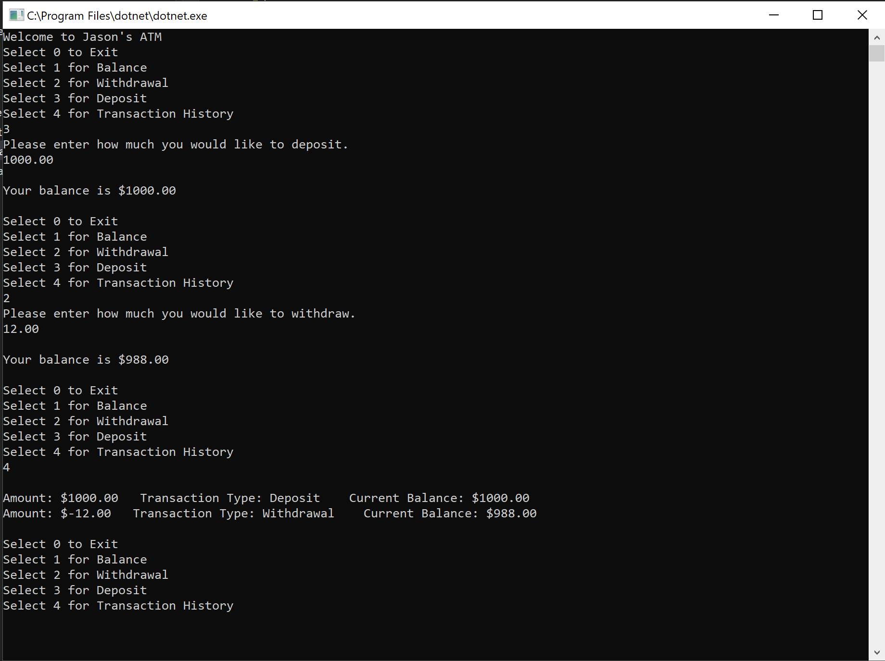

# Lab 02: Unit Testing
 - Create a bank “ATM” machine within a console application with VS2017
 
## Specs
- Your solution should include the following:
    - Main method
    - Testable external methods
    - User interface that prompts the user for standard ATM operations
      - View Balance
      - Withdraw Money
      - Add Money
      - Transaction History (Stretch Goal)
      - Exit Application
    - Exception Handling. Implement try, catch, finally and a throw within your program.
- A few things to keep in mind:
    - Make sure the user can't go below a zero balance.
    - You cannot unit test console WriteLine or Readlines.
    - Make sure your methods are just returning values and not reading input from the console.   
- When running your application, it should activate the game without any direct code manipulation
- Stay within scope of this project. Please only use concepts and resources that we have covered so far in previous labs/lectures/assigned prework. 
  - If you are unsure if it is within scope, please ask a TA or instructor.

## Unit Tests
- Provide unit tests for your ATM.
- For every method/action (that does not require user input), there should be a passing valid input, and a passing invalid input.
- Have at least 2 tests for every non-void method.
- A failing test, is not a valid test - even if the failure is expected.

## Example Usage
- When you run app.
    - Welcome to Jason's ATM:
      - Select 0 to Exit
      - Select 1 for Balance
      - Select 2 for Withdrawal
      - Select 3 for Deposit
      - Select 4 for Transaction History
        - USER INPUT: 3
      - Please enter how much you would like to deposit.
        - USER INPUT: 1000.00
        - Your balance is $1000.00  
      - Select 0 to Exit
      - Select 1 for Balance
      - Select 2 for Withdrawal
      - Select 3 for Deposit
      - Select 4 for Transaction History
        - USER INPUT: 2
      - Please enter how much you would like to withdraw.
        - USER INPUT: 12.00
        - Your balance is $988.00  
      - Select 0 to Exit
      - Select 1 for Balance
      - Select 2 for Withdrawal
      - Select 3 for Deposit
      - Select 4 for Transaction History
        - USER INPUT: 4
      - Amount: $1000   Transaction Type: Deposit    Current Balance: $1000.00
      - Amount: $-12   Transaction Type: Withdrawal    Current Balance: $988.00
    
 
## Screenshot of Usage

